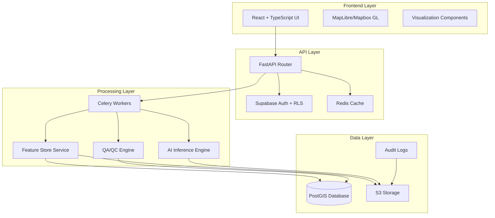

# Design Document

## Overview

The GeoVision AI Miner enterprise features implementation follows a microservices-oriented architecture within a monorepo structure. The design emphasizes scalability, security, and compliance while maintaining the existing FastAPI + React stack.

## Architecture

### System Architecture



### Database Schema Design

#### Feature Store Tables
```sql
-- Multi-scale grid cells for feature computation
CREATE TABLE fs_cells (
    cell_id UUID PRIMARY KEY DEFAULT gen_random_uuid(),
    geom GEOMETRY(POINT, 4326) NOT NULL,
    country TEXT NOT NULL,
    province TEXT,
    scale INTEGER NOT NULL, -- 1, 3, 5 km
    created_at TIMESTAMP WITH TIME ZONE DEFAULT NOW(),
    org_id UUID REFERENCES organizations(id),
    project_id UUID REFERENCES projects(id),
    data_classification TEXT DEFAULT 'internal'
);

-- Feature values for each cell
CREATE TABLE fs_features (
    cell_id UUID REFERENCES fs_cells(cell_id) ON DELETE CASCADE,
    feature_key TEXT NOT NULL,
    feature_val DOUBLE PRECISION NOT NULL,
    PRIMARY KEY (cell_id, feature_key)
);
```

#### Drill Hole Tables
```sql
-- Drill collar locations
CREATE TABLE drill_collars (
    hole_id TEXT PRIMARY KEY,
    geom GEOMETRY(POINT, 4326) NOT NULL,
    elevation DOUBLE PRECISION,
    start_date DATE,
    crs TEXT DEFAULT 'EPSG:4326',
    org_id UUID REFERENCES organizations(id),
    project_id UUID REFERENCES projects(id),
    data_classification TEXT DEFAULT 'internal'
);

-- Survey data for deviation correction
CREATE TABLE drill_surveys (
    id UUID PRIMARY KEY DEFAULT gen_random_uuid(),
    hole_id TEXT REFERENCES drill_collars(hole_id),
    depth DOUBLE PRECISION NOT NULL,
    azimuth DOUBLE PRECISION,
    dip DOUBLE PRECISION,
    method TEXT
);

-- Geological intervals
CREATE TABLE drill_intervals (
    id UUID PRIMARY KEY DEFAULT gen_random_uuid(),
    hole_id TEXT REFERENCES drill_collars(hole_id),
    from_m DOUBLE PRECISION NOT NULL,
    to_m DOUBLE PRECISION NOT NULL,
    lith_code TEXT,
    CONSTRAINT valid_interval CHECK (from_m < to_m)
);

-- Assay results
CREATE TABLE drill_assays (
    id UUID PRIMARY KEY DEFAULT gen_random_uuid(),
    hole_id TEXT REFERENCES drill_collars(hole_id),
    from_m DOUBLE PRECISION NOT NULL,
    to_m DOUBLE PRECISION NOT NULL,
    element TEXT NOT NULL,
    value DOUBLE PRECISION,
    units TEXT,
    CONSTRAINT valid_assay_interval CHECK (from_m < to_m)
);
```

#### LIMS/QA-QC Tables
```sql
-- Sample batches for chain of custody
CREATE TABLE coc_batches (
    batch_id UUID PRIMARY KEY DEFAULT gen_random_uuid(),
    created_at TIMESTAMP WITH TIME ZONE DEFAULT NOW(),
    status TEXT DEFAULT 'pending',
    org_id UUID REFERENCES organizations(id),
    project_id UUID REFERENCES projects(id)
);

-- Individual samples in batches
CREATE TABLE coc_items (
    id UUID PRIMARY KEY DEFAULT gen_random_uuid(),
    batch_id UUID REFERENCES coc_batches(batch_id),
    sample_id TEXT NOT NULL,
    barcode TEXT,
    state TEXT DEFAULT 'received'
);

-- QC rules and standards
CREATE TABLE qc_rules (
    id UUID PRIMARY KEY DEFAULT gen_random_uuid(),
    type TEXT NOT NULL, -- 'standard', 'blank', 'duplicate'
    tolerance DOUBLE PRECISION,
    element TEXT,
    org_id UUID REFERENCES organizations(id)
);

-- QC results and statistics
CREATE TABLE qc_results (
    id UUID PRIMARY KEY DEFAULT gen_random_uuid(),
    batch_id UUID REFERENCES coc_batches(batch_id),
    rule_id UUID REFERENCES qc_rules(id),
    status TEXT, -- 'pass', 'fail', 'warning'
    zscore DOUBLE PRECISION
);
```

## Components and Interfaces

### Feature Store Service

#### Core Components
- **FeatureComputer**: Celery task for multi-scale feature generation
- **FeatureCache**: Redis-based caching with parameter hashing
- **FeatureAPI**: FastAPI endpoints for feature retrieval
- **S3Exporter**: Parquet export functionality

#### Key Interfaces
```python
class FeatureStoreService:
    async def compute_features(
        self, 
        aoi: GeoJSON, 
        scales: List[int] = [1, 3, 5]
    ) -> str  # Returns task_id
    
    async def get_features(
        self,
        bbox: List[float],
        keys: Optional[List[str]] = None,
        scales: Optional[List[int]] = None,
        format: str = "parquet"
    ) -> Union[bytes, dict]
```

### AI Inference Engine

#### Components
- **ProspectivityModel**: Main ML model for mineral potential
- **UncertaintyEstimator**: Bayesian or ensemble uncertainty quantification
- **COGGenerator**: Cloud-optimized GeoTIFF output
- **STACPublisher**: Metadata catalog integration

#### Interfaces
```python
class AIInferenceEngine:
    async def run_inference(
        self,
        aoi: GeoJSON,
        model_version: str = "latest"
    ) -> InferenceResult
    
    async def retrain_model(
        self,
        labels: List[LabelData],
        base_model: str = "latest"
    ) -> ModelVersion
```

### Security & Access Control

#### RLS Policies
```sql
-- Organization-level access control
CREATE POLICY org_access ON fs_cells
    FOR ALL USING (org_id = current_setting('app.current_org_id')::UUID);

-- Project membership for write operations
CREATE POLICY project_write ON fs_cells
    FOR INSERT, UPDATE, DELETE
    USING (
        project_id IN (
            SELECT project_id FROM project_members 
            WHERE user_id = auth.uid() 
            AND role IN ('admin', 'analyst')
        )
    );

-- Data classification access
CREATE POLICY classification_access ON fs_cells
    FOR SELECT USING (
        CASE data_classification
            WHEN 'public' THEN true
            WHEN 'internal' THEN current_setting('app.user_role') != 'external'
            WHEN 'confidential' THEN current_setting('app.user_role') IN ('admin', 'analyst')
            ELSE false
        END
    );
```

## Data Models

### Feature Store Models
```python
from sqlalchemy import Column, String, Float, Integer, DateTime, ForeignKey
from sqlalchemy.dialects.postgresql import UUID
from geoalchemy2 import Geometry

class FSCell(Base):
    __tablename__ = 'fs_cells'
    
    cell_id = Column(UUID(as_uuid=True), primary_key=True, default=uuid4)
    geom = Column(Geometry('POINT', srid=4326), nullable=False)
    country = Column(String, nullable=False)
    province = Column(String)
    scale = Column(Integer, nullable=False)
    created_at = Column(DateTime(timezone=True), default=func.now())
    org_id = Column(UUID(as_uuid=True), ForeignKey('organizations.id'))
    project_id = Column(UUID(as_uuid=True), ForeignKey('projects.id'))
    data_classification = Column(String, default='internal')

class FSFeature(Base):
    __tablename__ = 'fs_features'
    
    cell_id = Column(UUID(as_uuid=True), ForeignKey('fs_cells.cell_id'), primary_key=True)
    feature_key = Column(String, primary_key=True)
    feature_val = Column(Float, nullable=False)
```

### Drill Hole Models
```python
class DrillCollar(Base):
    __tablename__ = 'drill_collars'
    
    hole_id = Column(String, primary_key=True)
    geom = Column(Geometry('POINT', srid=4326), nullable=False)
    elevation = Column(Float)
    start_date = Column(Date)
    crs = Column(String, default='EPSG:4326')
    org_id = Column(UUID(as_uuid=True), ForeignKey('organizations.id'))
    project_id = Column(UUID(as_uuid=True), ForeignKey('projects.id'))
    data_classification = Column(String, default='internal')
```

## Error Handling

### Error Categories
1. **Validation Errors**: Input validation, constraint violations
2. **Processing Errors**: Feature computation, AI inference failures
3. **Access Errors**: Authentication, authorization failures
4. **System Errors**: Database, storage, network issues

### Error Response Format
```python
class ErrorResponse(BaseModel):
    error_code: str
    message: str
    details: Optional[dict] = None
    timestamp: datetime
    request_id: str
```

## Testing Strategy

### Unit Tests
- Model validation and constraints
- Business logic functions
- Utility functions and helpers

### Integration Tests
- API endpoint functionality
- Database operations with RLS
- Celery task execution
- S3 storage operations

### End-to-End Tests
- Complete feature store workflow
- AI inference pipeline
- QA/QC report generation
- Access control scenarios

### Performance Tests
- Feature computation scalability
- API response times
- Database query performance
- Concurrent user scenarios

## Security Considerations

### Data Protection
- Encryption at rest using customer-managed keys
- Encryption in transit with TLS 1.3
- Field-level encryption for sensitive data

### Access Control
- Multi-tenant RLS policies
- ABAC with data classification
- API rate limiting and throttling
- Audit logging for all operations

### Compliance
- GDPR data residency requirements
- SOC 2 Type II controls
- Immutable audit trails
- Data retention policies